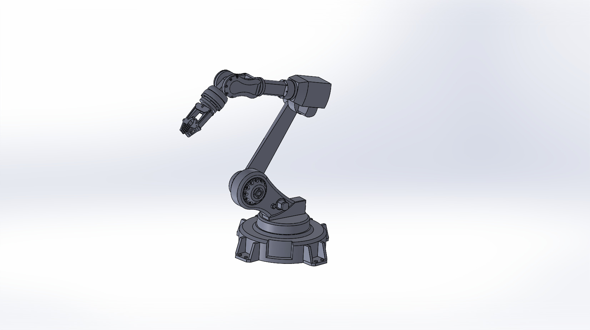
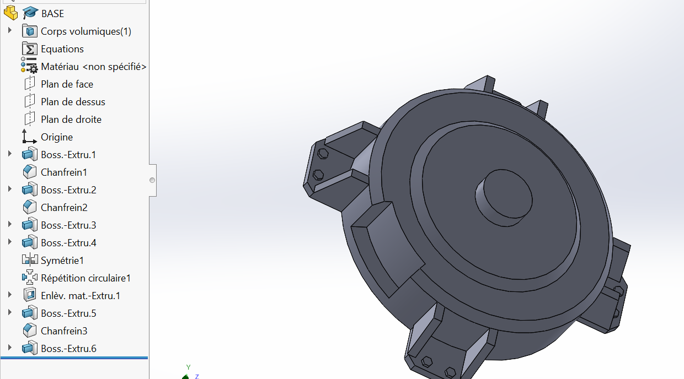
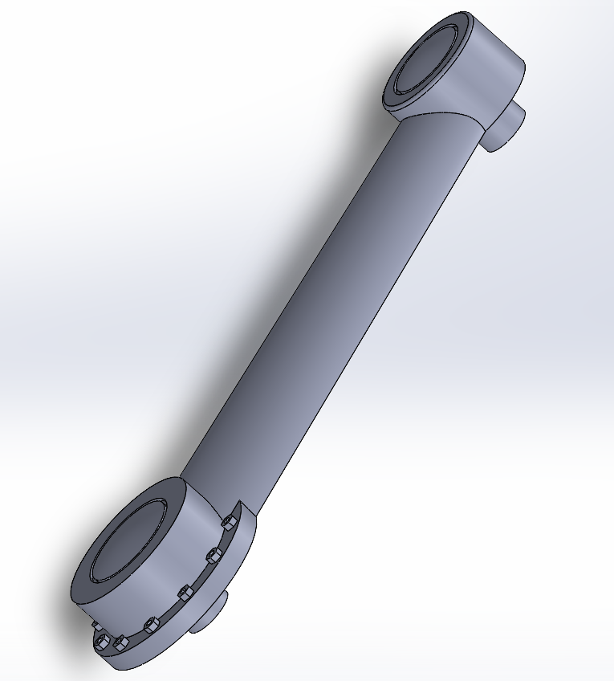
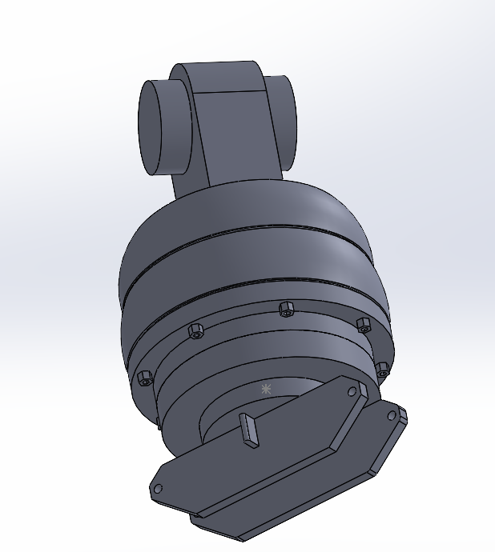
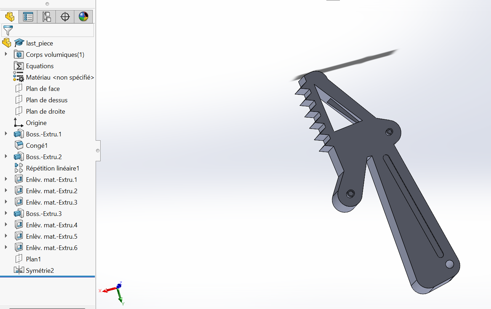

# Modélisation 3D — Bras robot 6 axes

> Projet CAO | SolidWorks | Modélisation pièce par pièce + assemblage

---

## Présentation

Conception 3D complète d'un bras robotique 6 axes sous SolidWorks.  
Le projet couvre la modélisation de chaque pièce constitutive du robot ainsi que leur assemblage, en s'inspirant de l'architecture d'un bras industriel réel.

---

## Aperçu



---

## Pièces modélisées

| Pièce | Aperçu | Fonctions SolidWorks utilisées |
|---|---|---|
| Base |  | Boss-Extrusion, Chanfrein, Symétrie, Répétition circulaire |
| Épaule (Lien 1) |  | Boss-Extrusion, Lissage, Enlèvement matière, Répétition circulaire |
| Bras (Lien 2) |  | Boss-Extrusion, Lissage, Enlèvement matière, Dôme, Congé |
| Base pince |  | Révolution, Boss-Extrusion, Répétition circulaire |
| Mors pince |  | Boss-Extrusion, Enlèvement matière, Répétition linéaire, Symétrie |

---

## Architecture du robot

Le robot est composé de **4 moteurs** (M1 à M4) répartis sur les différents axes :

- **M1** — Rotation de la base (axe vertical)
- **M2** — Rotation épaule
- **M3** — Rotation bras
- **M4** — Rotation avant-bras / poignet

---

## Arborescence du projet

```
robot-6-axes/
├── pieces/
│   ├── BASE.SLDPRT
│   ├── bras_lien1.SLDPRT
│   ├── bras_lien2.SLDPRT
│   ├── bras_lien4.SLDPRT
│   ├── base_pince.SLDPRT
│   └── last_piece.SLDPRT
├── assemblage/
│   └── robot_6axes.SLDASM
├── renders/
│   ├── assemblage_complet.png
│   ├── BASE_DU_ROBOT.png
│   ├── lien1_du_bras.png
│   ├── lien_2_du_bras.png
│   ├── BASE_PINCE.png
│   └── MORDS_PINCE.png
├── docs/
│   └── compte_rendu_modelisation_3D.pdf
└── README.md
```

---

## Outils utilisés

- **SolidWorks** — modélisation et assemblage
- Fonctions principales : Boss-Extrusion, Enlèvement matière, Lissage, Révolution, Répétition circulaire/linéaire, Symétrie, Congé, Chanfrein, Dôme

---

## Compétences démontrées

- Modélisation de pièces mécaniques complexes avec des formes organiques (lissage, dôme)
- Utilisation des répétitions et symétries pour des géométries circulaires
- Assemblage multi-pièces avec contraintes mécaniques
- Conception d'un effecteur (pince) avec mécanisme d'actionnement

---

## Documentation

Le compte rendu complet du projet est disponible dans [`docs/compte_rendu_modelisation_3D.pdf`](docs/compte_rendu_modelisation_3D.pdf).
