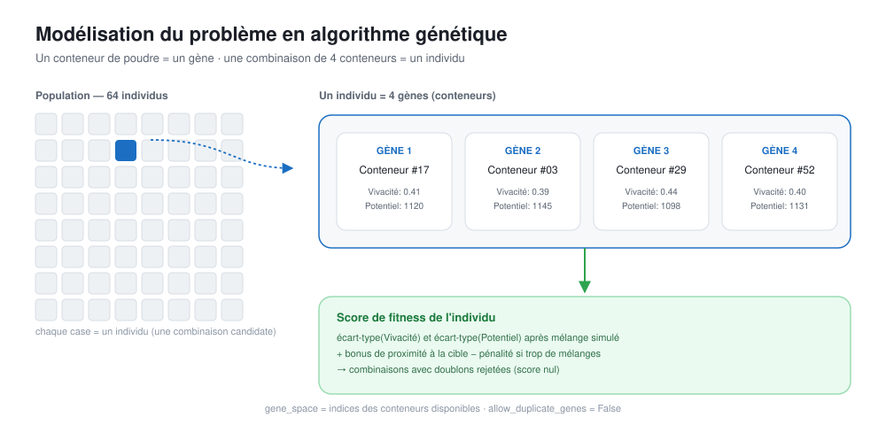
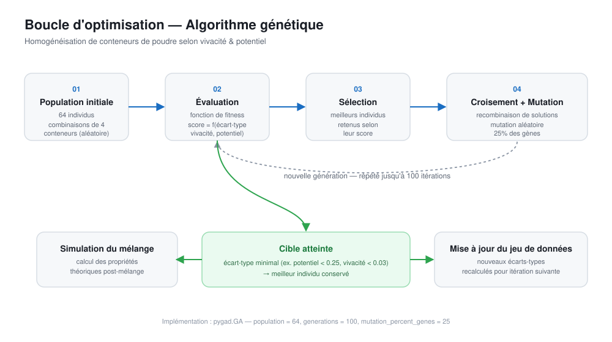
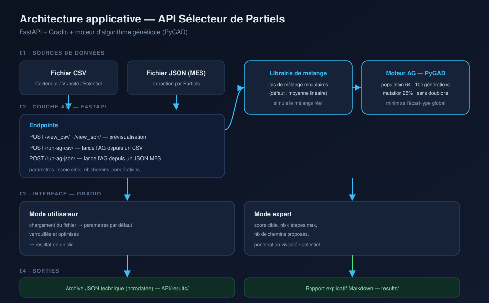

<h1>👋 Bonjour, je suis Eunice Bakeloula</h1>
<h3>Ingénieure en Automatisation & Robotique</h3>

<em>Concevoir des systèmes robotiques intelligents pour l'industrie de demain.</em>

  

  

  

---

# À propos de moi

Je suis ingénieure en **Systèmes Industriels et Robotique diplômée de Polytech**, passionnée par la conception, l'intégration et l'optimisation de systèmes automatisés et robotisés industriels.

Mes centres d'intérêt couvrent l'ensemble du cycle de vie d'un projet d'automatisation industrielle :

- 🤖 Robotique industrielle
- ⚙️ Automatisation & Automates Programmables Industriels (API/PLC)
- 👁️ Vision industrielle
- 🤝 Robotique collaborative
- 🏗️ Conception mécanique
- 🧠 Intelligence artificielle appliquée à l'industrie

J'aime transformer des concepts d'ingénierie en solutions industrielles concrètes, fiables et performantes.

Actuellement, je développe mes compétences à travers des projets personnels autour de la robotique, de la programmation automate et du développement logiciel industriel.

---

# 🚀 Projets principaux

## Robotique industrielle

<h2> Cellule industrielle de dépalettisation</h2>

<table>
<tr>
<td width="55%" valign="top">

Programmation hors ligne d'une cellule robotisée de dépalettisation réalisée avec <strong>RoboDK</strong>.

Le projet comprend :

<ul>
  <li>Robot Doosan M1013</li>
  <li>Rail linéaire (7ème axe)</li>
  <li>Préhenseur à ventouse</li>
  <li>Convoyeur industriel</li>
  <li>Planification de trajectoires</li>
  <li>Définition du TCP (<em>Tool Center Point</em>)</li>
  <li>Repères utilisateurs (<em>Reference Frames</em>)</li>
  <li>Génération de trajectoires sans collision</li>
</ul>

  

</td>
<td width="45%" valign="top" align="center">

<video autoplay loop muted playsinline controls width="100%">
  <source src="Robotique Industrielle/Pallétisation/media/gif_projet.mp4" type="video/mp4">
</video>

</td>
</tr>
</table>

## Paletisation sous RobotGuide

Application industrielle de prise et dépose utilisant :

- Robot Stäubli TX2-40
- Caméra SensoPart

Principaux éléments étudiés :

- Calibration caméra
- Détection d'objet
- Intégration robot-vision
- Prise et dépose automatisée (*Pick & Place*)
- Transformation de coordonnées

🎥 Vidéo de démonstration disponible

*(Dépôt GitHub prochainement)*

---

# Automatisation industrielle

Projets en cours de développement.

Prochains dépôts :

- Pilotage de convoyeurs
- Station de remplissage de bouteilles
- Système de tri automatisé
- Programmation API/PLC
- EcoStruxure Machine Expert

---

<h2>🏗️ Conception mécanique</h2>

<h3>🎛️ Boîtier de commande pour convoyeur Niryo</h3>

Le projet consiste à intégrer l'ensemble des composants fournis dans un boîtier compact, ergonomique et adapté à une production en série de 500 à 1 000 exemplaires.

<table>
<tr>
<td width="55%" valign="center">

Conception mécanique d'un boîtier de commande industriel réalisé avec <strong>SolidWorks</strong>.

Compétences mises en œuvre :

<ul>
  <li>Modélisation de pièces et d'assemblages sous SolidWorks</li>
  <li>Intégration mécanique de composants industriels (PCB, bouton d'arrêt d'urgence, potentiomètre, connectique, visserie)</li>
  <li>Prise en compte de contraintes d'encombrement, d'ergonomie et d'assemblage</li>
  <li>Réalisation de plans techniques et de modèles destinés à une fabrication en petite série</li>
  <li>Mise en plan technique</li>
</ul>

  

</td>
<td width="45%" valign="top">

  
  

</td>
</tr>
</table>

# 💼 Expériences professionnelles

## 🏭 Ingénieure Industrie 4.0 - Alternance

**Eurenco**

Missions principales :

- Études de faisabilité robotique et automatisation d'un système de prélèvement de palettes en milieu pyrotechnique 
- Rédaction de spécifications techniques
- Projets automatisme, électriques et instrumentation
- Supervision industrielle
- Coordination de projets

---

<h2>🎥 Robotique Industrielle & Vision</h2>

<table>
<tr>
<td width="55%" valign="top">

Application industrielle de prise et dépose utilisant :

<ul>
  <li>Robot Stäubli TX2-40</li>
  <li>Caméra SensoPart</li>
</ul>

Principaux éléments étudiés :

<ul>
  <li>Calibration caméra</li>
  <li>Détection d'objet</li>
  <li>Intégration robot-vision</li>
  <li>Prise et dépose automatisée (<em>Pick &amp; Place</em>)</li>
  <li>Transformation de coordonnées</li>
</ul>

</td>

<td width="45%" valign="top" align="center">

<video autoplay loop muted playsinline controls width="100%">
  <source src="Im/demo/demo_projetTX240.mp4" type="video/mp4">
  Votre navigateur ne supporte pas la vidéo.
</video>

</td>
</tr>
</table>

<h2> Stagiaire Ingénieure Automatisation & Robotique</h2>

<table>
<tr>
<td width="55%" valign="top">

<strong>Syensqo</strong>

Développement d’une plateforme robotisée automatisée de préparation d’échantillons (cobot UR3e).

Missions principales :

<ul>
  <li>Robotique collaborative</li>
  <li>Programmation robot UR3</li>
  <li>Conception sous SolidWorks de pièces de fixation des instruments (balance, vortex, pipette) pour la reproductibilité des trajectoires et programmation du robot en Python POO</li>
  <li>Automatisation de procédés en laboratoire</li>
</ul>

</td>

<td width="45%" valign="top" align="center">

<video autoplay loop muted playsinline controls width="100%">
  <source src="Im/demo/demo%20stage.mp4" type="video/mp4">
  Votre navigateur ne supporte pas la vidéo.
</video>

</td>
</tr>
</table>

<h2> Intelligence artificielle & optimisation industrielle</h2>

<h3>🧬 Optimisation de mélanges industriels par algorithme génétique</h3>

Développement d’un outil d’aide à la décision pour optimiser l’homogénéisation de lots de matière première en contexte industriel.

L’objectif est de réduire la dispersion des propriétés physico-chimiques critiques d’un lot en proposant automatiquement les meilleures combinaisons de conteneurs à mélanger.

<h4>Approche</h4>

Le problème est formulé comme une optimisation combinatoire : chaque conteneur est considéré comme un élément de recherche, et chaque combinaison de 4 conteneurs constitue une solution candidate.

L’algorithme fait évoluer une population de 64 solutions sur 100 générations à l’aide de mécanismes de sélection, croisement et mutation, avec une fonction de fitness orientée vers la réduction de l’écart-type sur les propriétés cibles.

  

<h4>Processus d’optimisation</h4>

À chaque génération, les solutions sont évaluées puis améliorées jusqu’à atteindre le seuil de dispersion défini, ou jusqu’à l’épuisement du nombre maximal de générations.

  

<h4>Architecture logicielle</h4>

Le moteur d’optimisation, développé avec <strong>PyGAD</strong>, est exposé via une <strong>API FastAPI</strong> et une <strong>interface Gradio</strong> à deux niveaux :

<ul>
  <li>un mode utilisateur simplifié avec paramètres verrouillés ;</li>
  <li>un mode expert permettant d’ajuster les seuils, pondérations et nombre de solutions proposées.</li>
</ul>

Chaque exécution produit une archive JSON horodatée ainsi qu’un rapport Markdown exploitable par des utilisateurs non techniques.

  

<h4>Résultats</h4>

L’approche permet d’identifier rapidement des combinaisons satisfaisantes, avec une réduction du nombre d’itérations nécessaires par rapport à la méthode manuelle.

<h4>Stack technique</h4>

Python · PyGAD · FastAPI · Gradio · Pandas

<h4>Compétences démontrées</h4>

<ul>
  <li>Modélisation d’un besoin métier en problème d’optimisation combinatoire.</li>
  <li>Conception d’une fonction de fitness multi-critères.</li>
  <li>Développement d’une architecture logicielle modulaire.</li>
  <li>Vulgarisation technique pour un usage opérationnel.</li>
</ul>

<h4>🛠️ Compétences techniques</h4>

  
<strong>Robotique</strong>

  

    FANUC
    Stäubli
    Universal Robots
    RoboDK
    SRS
    RobotGuide
    ROS 2
    Programmation hors ligne
  

  
<strong>Automatisation</strong>

  

    API/PLC
    Grafcet
    EcoStruxure Machine Expert
  

  
<strong>Programmation</strong>

  

    Python
    C++
    MATLAB / Simulink
  

  
<strong>CAO</strong>

  

    SolidWorks
    Inventor
    Creo
  

  
<strong>Vision industrielle</strong>

  

    SensoPart
    Calibration caméra
    Robotique guidée par vision
  

---

# 🎓 Formation

🎓 **Diplôme d'ingénieure**

Spécialité :

**Systèmes Industriels & Robotique**

🏫 Polytech

---

# 📚 Compétences actuellement développées

- Programmation API Schneider
- Navigation ROS 2
- Robotique mobile
- Architecture logicielle industrielle

---

# 💡 Ma vision de l'ingénierie

Pour moi, la robotique industrielle ne se limite pas à programmer un robot.

Un système robotisé performant est le résultat de l'intégration de plusieurs expertises :

✔ Conception mécanique  
✔ Automatisation  
✔ Programmation robotique  
✔ Vision industrielle  
✔ Développement logiciel  
✔ Sécurité machine  
✔ Intégration industrielle  

Cette approche globale guide chacun de mes projets.

---

# 📬 Restons connectés

  
  
  <a href="assets/CV_Eunice_BAKELOULA_Roboticien.pdf" target="_blank" rel="noopener noreferrer">
    
  

