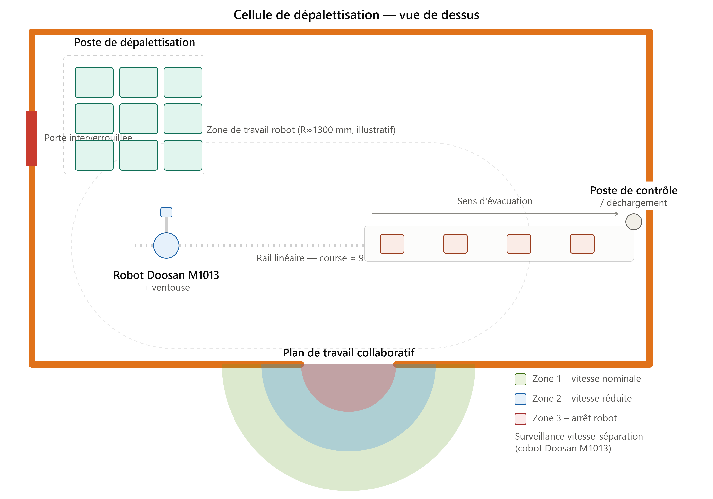

# Cellule de dépalettisation robotisée - RoboDK

**Simulation d'une cellule industrielle de dépalettisation automatique** : un robot Doosan M1013 monté sur rail linéaire prélève des cartons sur une palette à 3 étages et les dépose sur un convoyeur, à l'aide d'un préhenseur à ventouse.

  


<!-- GIF 10-15s en boucle du cycle complet -->

---

## Contexte

La dépalettisation est une des tâches les plus courantes en logistique et en industrie manufacturière : réception de palettes fournisseur, préparation de commandes, alimentation de lignes de production. C'est aussi un excellent cas d'école en robotique parce qu'elle combine plusieurs problématiques classiques en une seule cellule : gestion de repères multiples, trajectoires répétitives à grande échelle (jusqu'à plusieurs dizaines de points), intégration d'un axe externe, et coordination avec un convoyeur.

Ce projet reproduit cette problématique en simulation, avec l'objectif de démontrer une méthodologie de programmation robot — indépendamment du langage constructeur final (VAL3, DRL, KRL, RAPID...).

## Objectif

- Prélever chaque carton d'une palette, dans un ordre défini
- Déposer chaque carton sur un convoyeur
- Étendre l'espace de travail du robot via un axe externe (rail linéaire)
- Manipuler les cartons avec un préhenseur à ventouse
- Structurer le programme de façon modulaire et réutilisable

## Sommaire

- [Architecture](#architecture)
- [Matériel & logiciel](#matériel--logiciel)
- [Méthodologie](#méthodologie)
- [Structure du programme](#structure-du-programme)
- [Algorithme](#algorithme)
- [Choix techniques et compromis](#choix-techniques-et-compromis)
- [Limites de la simulation](#limites-de-la-simulation)
- [Transposition vers un logiciel constructeur](#transposition-vers-un-logiciel-constructeur)
- [Compétences démontrées](#compétences-démontrées)
- [Pistes d'amélioration](#pistes-daméliroation)
- [Reproduire le projet](#reproduire-le-projet)
- [Structure du dépôt](#structure-du-dépôt)

## Architecture



## Matériel & logiciel

| Élément | Référence | Caractéristiques |
|---|---|---|
| Robot | Doosan Robotics M1013 (série M, cobot 6 axes) | Charge utile 10 kg, portée max. 1300 mm, répétabilité ±0,05 mm, vitesse TCP 1 m/s |
| Axe externe | Rail linéaire (7e axe) | Étend l'espace de travail le long de la palette et du convoyeur |
| Préhenseur | Ventouse | Attache/détache des objets (`cartons`)|
| Palette | Palette Modèle 1200*800 | 3 Etages de 9 Cartons référencés `T_Box_1_1` … `T_Box_3_2`, repère local `Pallet` |
| Convoyeur | Convoyeur générique | Point de dépose référencé `AppConveyor` / `Conveyor` |
| Logiciel | RoboDK | Simulation, définition des repères/TCP, programmation par cibles, export post-processeur |

Le M1013 communique nativement en RS232/485, TCP/IP, Modbus TCP/RTU, PROFINET IO Device et EtherNet/IP - pertinent pour une intégration réelle avec un automate de ligne.

## Méthodologie

### Définition des repères

| Repère | Rôle |
|---|---|
| `World` | Référence absolue de la cellule |
| `Tool` | Repère lié au TCP de la ventouse, solidaire de la bride |
| `Pallet` | Référence locale pour générer les positions des cartons à depallétiser |
| `Conveyor Belt` | Référence locale pour la dépose |

J'ai travaillé en repères relatifs plutôt qu'en coordonnées absolues afin que si la palette ou le convoyeur est redéfini physiquement (recalibrage, déplacement), seul le repère parent est corrigé pas les dizaines de points qui en dépendent.

### TCP (Tool Center Point)

Le TCP est défini au point de contact ventouse: toute orientation et toute trajectoire programmée est calculée par rapport à ce point, ce qui simplifie l'approche verticale et le contact avec chaque carton sans recalcul manuel.

### Points d'approche

Chaque cycle de prise suit systématiquement le même schéma :

```
Approche (retrait sécurisé) → Pick → Approche → Approche convoyeur → Drop → Approche
```

Les points d'approche ne sont pas une redondance — ils remplissent quatre fonctions précises :
- **Anti-collision** : pas de trajectoire directe entre deux points éloignés
- **Reproductibilité** : le même chemin est emprunté à chaque cycle
- **Maintenabilité** : modifier un point d'approche ne casse pas le reste du programme
- **Sécurité** : retrait vertical systématique avant tout déplacement latéral

Schéma détaillé : `media/reperes.svg`

## Structure du programme

```
MainProgram
   ├── Call GoHome
   ├── Call ReplaceObjects
   ├── Pause 10.0 s
   ├── Call RunConveyor
   ├── Pour chaque carton :
   │     ├── Set Ref: Pallet
   │     ├── MoveJ (T_Box_x)
   │     ├── Call Pick
   │     ├── Call AppPallet
   │     ├── Call DropConveyor
   │     └── Call AppPallet
   └── Call GoHome
```

| Sous-programme | Rôle |
|---|---|
| `GoHome` | Retour position de repos, repère `World`, changement d'outil |
| `Pick` | Attache logique du carton (activation ventouse) |
| `AppPallet` | Point d'approche palette avant/après prise |
| `DropConveyor` | Approche, dépose, détachement, retrait sur le convoyeur |
| `RunConveyor` | Démarrage du convoyeur |

Schéma détaillé : `media/flux-programme.svg`

## Algorithme

```
Début
  ↓
Home
  ↓
Démarrage convoyeur
  ↓
Pour chaque carton (étage 1 → 3) :
    Approche palette → Pick → Retour → Approche convoyeur → Drop → Retour
  ↓
Home
  ↓
Fin
```

## Choix techniques et compromis

Quelques décisions de conception qui méritent d'être justifiées plutôt que simplement énoncées :

- **MoveJ plutôt que MoveL sur les trajectoires d'approche** : privilégié pour la vitesse de cycle, au prix d'une trajectoire moins prévisible géométriquement. Sur un vrai robot, ce choix serait validé par simulation de collision avant déploiement.
- **Grille de points paramétrée par le repère `Pallet` plutôt que 27 points enseignés manuellement** : réduit drastiquement le temps de programmation et facilite le changement de configuration de palette (nombre de cartons, dimensions), au prix d'une dépendance plus forte à la précision du repère parent.
- **Axe externe (rail) plutôt que repositionnement de la base robot** : permet de couvrir à la fois la palette et le convoyeur avec une seule cellule, sans dupliquer le robot — compromis classique coût/encombrement vs flexibilité de portée.
- **Une ventouse plutôt qu'une pince mécanique** : adaptée à la manutention de cartons (surface plane, pas de préhension par les bords), mais dépendante de l'état de surface du carton (poussière, carton froissé) en conditions réelles.

## Limites de la simulation

Un point important pour rester honnête sur la portée du projet :

- Positions des cartons supposées connues et fixes — aucune vision industrielle ni bin-picking dynamique
- Pas de validation de collision physique réelle (uniquement la détection RoboDK)
- Pas d'intégration à un automate ou à une supervision de ligne réelle
- Temps de cycle non mesuré/optimisé sur robot physique (accélérations, zones de lissage non calibrées pour du matériel réel)
- Calibrage des repères effectué virtuellement, pas par palpage physique

## Transposition vers un logiciel constructeur

RoboDK est un outil de simulation et de programmation hors-ligne (OLP), pas un langage constructeur. Ce qui est directement transférable vers un environnement réel (Stäubli VAL3, Doosan DRL, Fanuc TP, KUKA KRL, ABB RAPID...) :

- La logique de repères (`World`/`Tool`/repères locaux)
- La définition et la justification du TCP
- La stratégie de points d'approche/retrait
- La structuration modulaire du programme
- La logique algorithmique de la boucle de traitement

Ce qui change en environnement réel : la syntaxe du constructeur, le calibrage physique du TCP et des repères, la configuration des E/S de sécurité réelles, l'intégration bus de terrain, et l'optimisation des temps de cycle sur robot physique.

## Compétences démontrées

- Définition et hiérarchisation de repères en robotique industrielle
- Méthodologie de calibrage et de justification d'un TCP
- Conception de trajectoires sécurisées (points d'approche, anti-collision)
- Structuration modulaire d'un programme robot
- Intégration d'un axe externe (7e axe)
- Capacité à documenter des choix techniques et leurs compromis
- Transposition d'une méthodologie de simulation vers un environnement constructeur réel

## Pistes d'amélioration

- Ajout d'un module de vision pour de la dépalettisation avec positions variables
- Export via post-processeur RoboDK vers du code natif Doosan DRL, pour valider la transposition sur robot réel
- Mesure et optimisation du temps de cycle
- Ajout d'une gestion d'erreurs (carton manquant, échec de préhension)

## Reproduire le projet

1. Installer [RoboDK](https://robodk.com/download) (version utilisée : à préciser)
2. Ouvrir le fichier `.rdk` du projet
3. Lancer `MainProgram` depuis l'arborescence du projet pour exécuter le cycle complet

## Structure du dépôt

```
depalletizing-cell/
├── README.md
├── project.rdk
├── media/
│   ├── demo.gif
│   ├── architecture.svg
│   ├── reperes.svg
│   └── flux-programme.svg
└── docs/
    └── methodologie-transposition.md
```

Ce projet fait partie d'un ensemble de 3 cellules robotisées simulées sous RoboDK, de complexité croissante : pick & place simple, pick & place avec préhenseur à ventouse, puis cette cellule de dépalettisation avec axe externe.

---

*Projet réalisé sous RoboDK — simulation à but d'apprentissage et de démonstration de méthodologie.*
